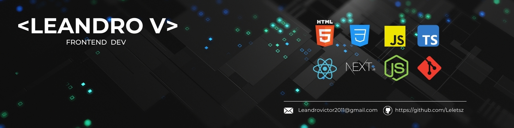

  

<h1 align="center">Leandro Victor Freire de Andrade</h1>

### Full Stack Developer

Desenvolvedor focado na construção de aplicações web modernas,
escaláveis e com boa experiência de usuário.

Atualmente trabalho principalmente com **TypeScript, React, Next.js e Node.js**,
desenvolvendo projetos completos do frontend ao backend.

---

## Tecnologias

### Frontend

### Backend

### Ferramentas

---

## Projetos em destaque

### DentalSync

SaaS para gerenciamento de clínicas odontológicas,
com painel administrativo e página pública de agendamento.

**Tecnologias:** Next.js · TypeScript · Prisma · Tailwind CSS

[🔗 Ver projeto](https://github.com/Leletsz/DentalSync)

---

### PizzaPlus

Sistema completo para gerenciamento de pedidos de pizzarias,
com frontend, backend e aplicação mobile.

**Tecnologias:** TypeScript · React · Node.js · API REST

[🔗 Ver projeto](https://github.com/Leletsz/PizzaPlus)

---

### TURBOBASE

Aplicação web para gerenciamento e apresentação de veículos.

**Tecnologias:** React · TypeScript · Vite

[🔗 Ver projeto](https://github.com/Leletsz/TURBOBASE)

---

## Atualmente estudando

- Arquitetura de aplicações
- APIs REST
- Banco de dados
- Docker
- Testes automatizados
- Boas práticas de desenvolvimento

---

## Contato

[LinkedIn](https://www.linkedin.com/in/leandrovictordev/)

[Instagram](https://www.instagram.com/lele_v3/)

---

💡 Sempre buscando transformar ideias em aplicações reais.
